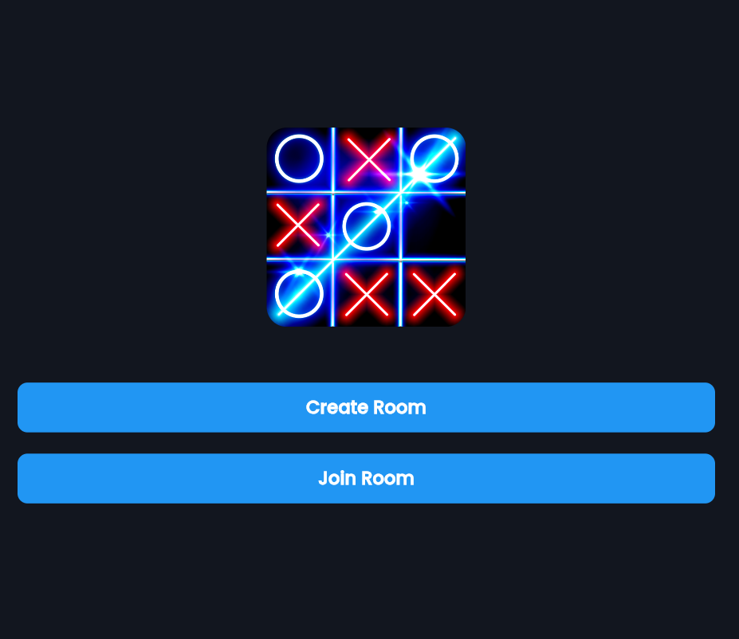
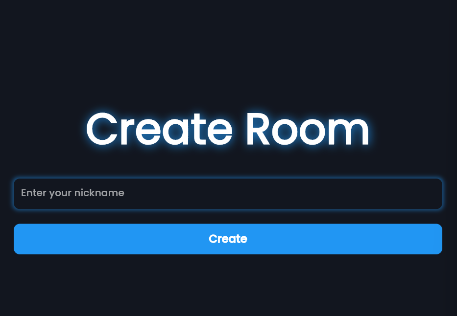
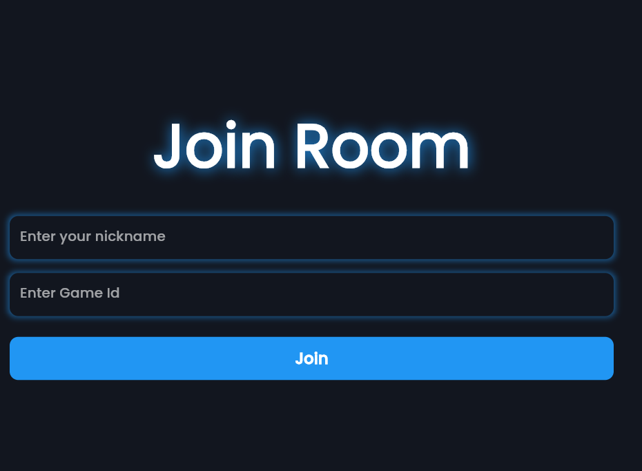
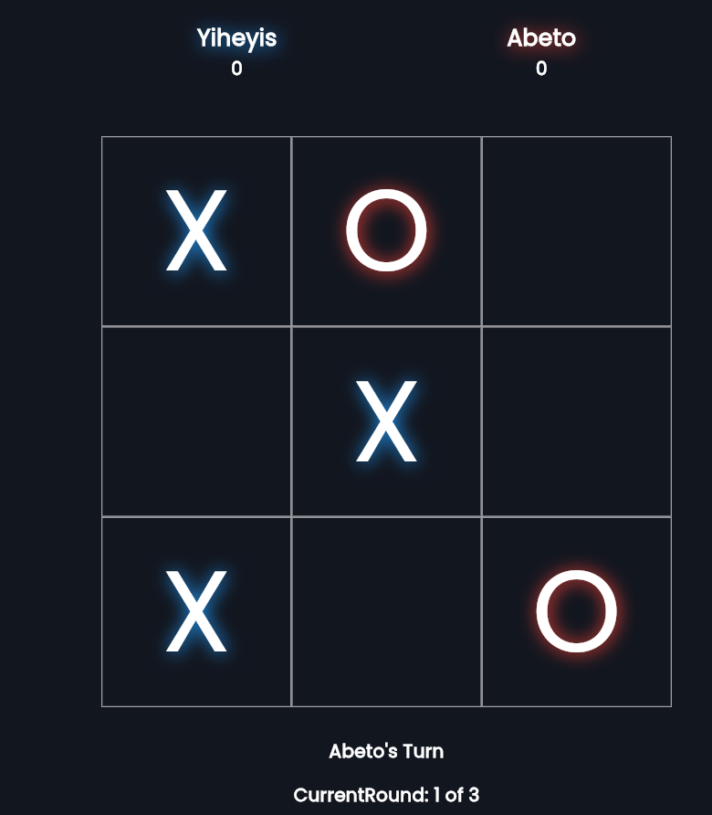
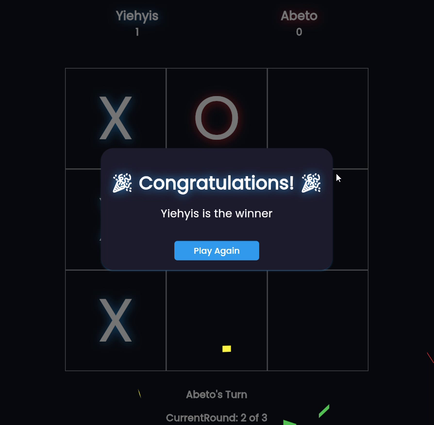

# TicTacToe Game

A real-time multiplayer Tic-Tac-Toe game built with Flutter (Dart) for the client and Node.js + Socket.IO + MongoDB for the backend. The app supports Android, iOS, Web, Windows, macOS, and Linux.

## Table of Contents

- [Features](#features)
- [Tech Stack](#tech-stack)
- [Project Structure](#project-structure)
- [Demo Images](#demo-images)
- [Getting Started](#getting-started)
  - [Prerequisites](#prerequisites)
  - [Backend Setup (Node.js + MongoDB)](#backend-setup-nodejs--mongodb)
  - [Frontend Setup (Flutter)](#frontend-setup-flutter)
- [Usage](#usage)
- [Troubleshooting](#troubleshooting)
- [Contributing](#contributing)
- [License](#license)

## Features

- Real-time multiplayer gameplay over Socket.IO
- Create and join rooms with short room IDs
- Turn-based play with synchronized game state across clients
- Score tracking, round progression, and winner announcement
- Responsive UI, dark theme, and Google Fonts

## Tech Stack

- Client: Flutter (Dart)
  - Routing: `go_router`
  - State management: `provider`
  - UI: `google_fonts`, Material 3, custom widgets
  - Realtime: `socket_io_client` (websocket transport)
  - Utilities: `confetti`, `get_ip_address`
- Server: Node.js
  - Framework: `express`
  - Realtime: `socket.io`
  - Database: MongoDB with `mongoose`
  - Environment: `dotenv`

## Project Structure

High-level layout of the repo:

- `lib/`
  - `main.dart` – App entry, theme, and router setup
  - `core/`
     - `routes/` – GoRouter routes and names
     - `provider/` – `RoomDataProvider` for room, players, and board state
     - `screen/` – Screens (main menu, create/join room, game room, waiting lobby)
     - `utils/` – Constants, dialogs, snackbars
     - `widgets/` – Reusable UI components (board, score, buttons, text)
     - `reponsiveness/` – Responsive helpers
  - `services/` – Client services, e.g. `socket_client_services.dart`
  - `models/` – Dart models
     - `server/` – Node.js backend (Express + Socket.IO + MongoDB)
        - `index.js`, `app.js`, `models/`, `db/`, `public/`
- `assets/` – Images (e.g., `assets/images/tictactoe.png`)
- `demo_image/` – App screenshots
- Platform folders: `android/`, `ios/`, `web/`, `windows/`, `macos/`, `linux/`

## Demo Images







## Getting Started

### Prerequisites

- Flutter SDK installed and configured
- Node.js 18+ (LTS recommended)
- MongoDB (local or cloud, e.g., MongoDB Atlas)

### Backend Setup (Node.js + MongoDB)

1. Open a terminal in the project root and navigate to the backend folder:

    ```powershell
    cd "lib/models/server"
    ```

2. Install dependencies:

    ```powershell
    npm install
    ```

3. Configure environment variables. Create a `.env` file in `lib/models/server` (if it doesn't exist) and set your MongoDB connection string:

    ```env
    MONGO_DB_CONNECTION_STRING=your_mongodb_connection_string
    PORT=3000
    ```

4. Start the server:

    ```powershell
    node index.js
    ```

    The server listens on all interfaces (0.0.0.0) and logs its URL. Ensure your device running the Flutter app can reach this IP/port.

### Frontend Setup (Flutter)

1. From the project root, fetch dependencies:

    ```powershell
    flutter pub get
    ```

2. Point the client to your backend URL. Edit `lib/services/socket_client_services.dart` and set `_url` to your machine's LAN IP and backend port, for example:

    ```dart
    final String _url = 'http://192.168.X.X:3000';
    ```

3. Run the Flutter app on your target platform:

    ```powershell
    flutter run
    ```

    Tip: For Web, ensure the backend is reachable from the browser and not blocked by firewalls.

## Usage

1. Launch the app on two devices/emulators connected to the same network.
2. On device A, enter a nickname and Create Room. A short Room ID will be generated.
3. On device B, enter the same Room ID and a nickname to Join Room.
4. Play! Taps are synchronized; scores and rounds update automatically. Winner dialogs will appear at the end of rounds/game.

## Troubleshooting

- Client cannot connect to server:
  - Confirm `_url` in `socket_client_services.dart` points to the correct LAN IP and port.
  - Ensure the Node server is running and MongoDB is reachable.
  - Temporarily allow inbound connections for port 3000 in your firewall.
  - Verify both devices are on the same network (for local testing).
- Room not found / invalid ID:
  - Double-check the 10-character Room ID.
  - Ensure you joined within the same server session (rooms reset on server restart).

## Contributing

Contributions are welcome! Please open an issue to discuss changes or submit a pull request.

## License

Specify a license for your project (e.g., MIT) by adding a `LICENSE` file and updating this section accordingly.
